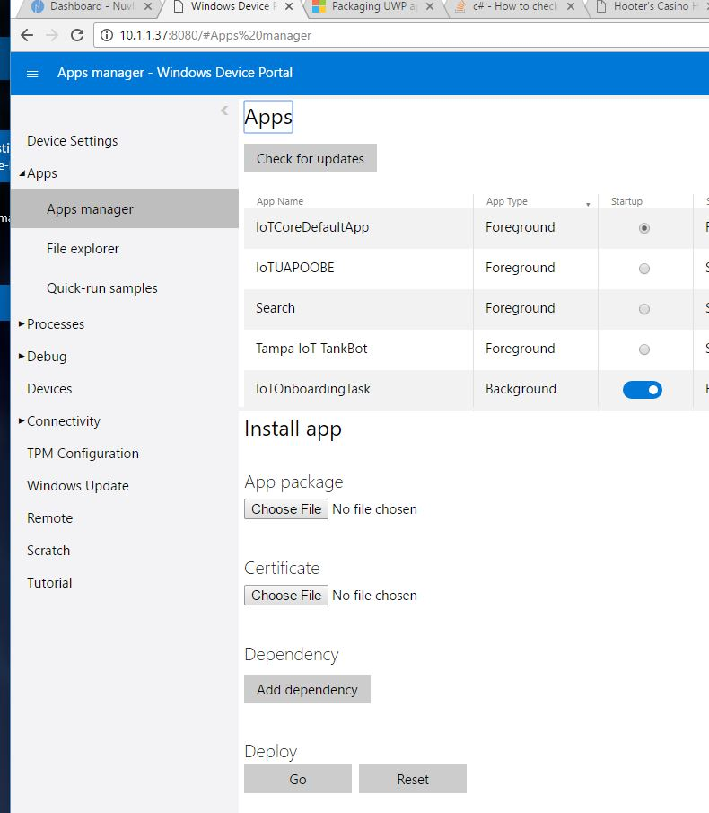

# Releases

### Desktop Application

1) To Install the Desktop Application you need to [Enable Developer Mode](https://docs.microsoft.com/en-us/windows/uwp/get-started/enable-your-device-for-development)

2) Download and un-zip the latest release from: https://github.com/TampaIoT/TankBot/tree/master/Releases/App

3) Follow these instructions to [side load the application](https://docs.microsoft.com/en-us/windows/uwp/packaging/packaging-uwp-apps#sideload-your-app-package)

### Windows 10 IoT Core Application

1) Open the Windows 10 IoT Device Portal

2) Either pull the latest file or download the App Firmware and Dependencies

Releases are Located in the [Firmeware Folder](https://github.com/TampaIoT/TankBot/tree/master/Releases/Firmware)

3) You will need to install the primary Application File from the Version Directory And then upload all the dependencies as in:

